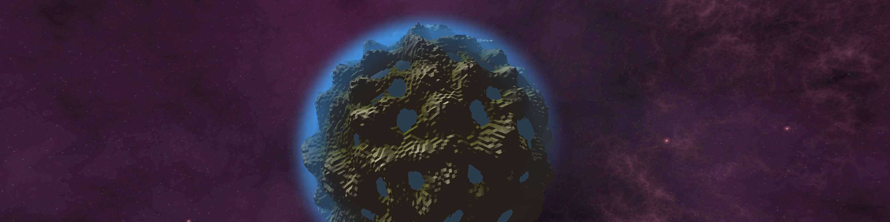
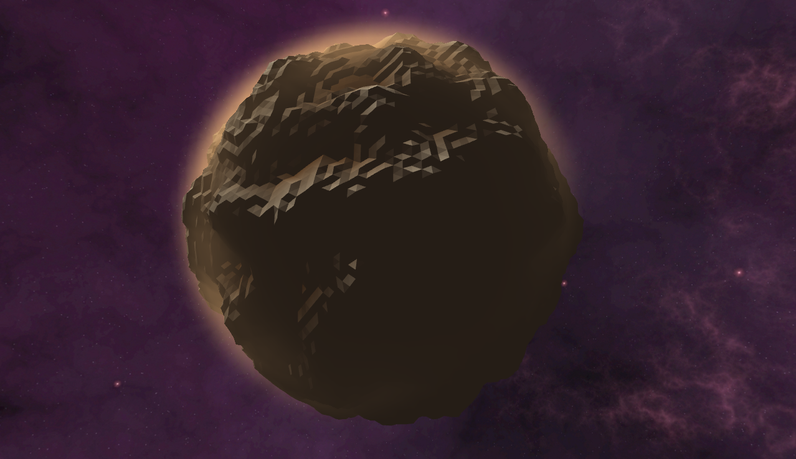
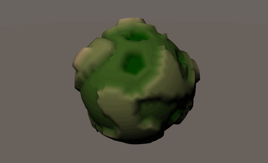

# Procedural Planet in Unity (Work in progress)

## How to open
Download and open procedural-planet.unitypackage and use the sliders. Color palettes are currently changed within shaders of the planet object.

### Notes

Procedural planet mesh generater with shaders for surface and atmosphere. 
Sphere is a generated goldberg polyhedra with simplex noise.

Recursion levels can be set as well as height steps. Sharp edges are generated within shader code.

Old gif of seed-changing with simplex noise seen below (contains stitching bug taken care of):

